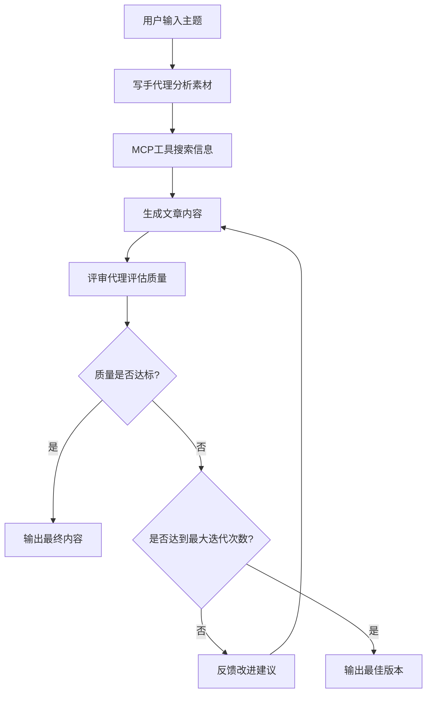

# Columnist Agent System v2 📝

一个基于 OpenAI SDK 和 MCP (Model Context Protocol) 的多代理专栏写作系统，专为小红书等社交平台内容创作而设计。

## 🚀 系统特性

### 核心功能
- **多代理架构**: 写手代理 + 评审代理 + 同步控制器
- **智能内容生成**: 基于主题和素材生成高质量内容
- **内容质量评估**: 多维度评分和反馈机制
- **平台适配**: 专门优化小红书内容格式
- **批量处理**: 支持批量生成和发布
- **MCP工具集成**: 网络搜索和事实核查

### 技术架构
- **Agent Framework**: OpenAI SDK (AsyncOpenAI)
- **工具协议**: MCP (Model Context Protocol) with SSE
- **Web服务**: Flask-based MCP Server
- **配置管理**: YAML + 环境变量
- **发布集成**: 小红书 API 集成

## 📁 项目结构

```
rnotegen_v2/
├── README.md                  # 项目文档
├── requirements.txt           # 依赖包列表
├── main.py                   # 主入口程序
├── synchronizer.py           # 内容同步控制器
├── config/                   # 配置文件目录
│   ├── .env.example         # 环境变量示例
│   ├── writer_config.yaml   # 写手代理配置
│   └── reviewer_config.yaml # 评审代理配置
├── agents/                   # 代理程序目录
│   ├── __init__.py
│   ├── writer_agent.py      # 写手代理
│   └── reviewer_agent.py    # 评审代理
├── mcp_server/              # MCP服务器
│   ├── __init__.py
│   ├── server.py           # Flask SSE服务器
│   ├── web_search.py       # 网络搜索工具
│   └── fact_check.py       # 事实核查工具
├── publisher/               # 发布模块
│   ├── __init__.py
│   └── rednote.py          # 小红书发布器
├── utils/                   # 工具函数
│   ├── __init__.py
│   ├── config_loader.py    # 配置加载器
│   └── logger.py           # 日志工具
└── examples/                # 使用示例
    ├── __init__.py
    └── example_usage.py     # 示例代码
```

## 🛠️ 安装配置

### 1. 环境要求
- Python 3.8+
- OpenAI API 访问权限
- 网络连接（用于搜索和事实核查）

### 2. 安装依赖
```bash
cd rnotegen_v2
pip install -r requirements.txt
```

### 3. 配置环境变量
复制 `.env.example` 到 `.env` 并配置：

```bash
cp config/.env.example config/.env
```

编辑 `.env` 文件：
```env
# OpenAI API 配置
OPENAI_API_KEY=your_openai_api_key_here
OPENAI_BASE_URL=https://api.openai.com/v1
OPENAI_MODEL=gpt-4o

# 小红书 API 配置 (可选)
REDNOTE_APP_ID=your_app_id
REDNOTE_APP_SECRET=your_app_secret
REDNOTE_ACCESS_TOKEN=your_access_token
```

### 4. 启动 MCP 服务器
```bash
# 在一个终端窗口中启动 MCP 服务器
python -m mcp_server.server
```

服务器将在 `http://localhost:5000` 启动。

## 📖 使用指南

### 命令行接口

#### 生成单篇内容
```bash
python main.py generate --theme "人工智能在日常生活中的应用" \
  --requirements "写一篇适合小红书的科普文章，语言轻松有趣" \
  --materials "AI助手" "智能家居" "AI医疗应用"
```

#### 批量生成内容
```bash
python main.py batch --themes "Python编程技巧" "数据科学入门" "机器学习实战" \
  --requirements "技术分享类文章" \
  --publish --draft
```

#### 检查系统状态
```bash
python main.py status
```

### 编程接口

```python
import asyncio
from main import ColumnistAgentCLI

async def example():
    cli = ColumnistAgentCLI()
    
    # 生成单篇内容
    result = await cli.generate_single_content(
        theme="Python编程入门",
        requirements="适合初学者的技术文章",
        materials=["基础语法", "实践项目", "学习资源"],
        publish=False
    )
    
    print(f"生成结果: {result['status']}")
    print(f"标题: {result['article']['title']}")
    print(f"评分: {result['review']['score']}")

# 运行示例
asyncio.run(example())
```

## 🔧 配置说明

### 写手代理配置 (writer_config.yaml)

```yaml
writer:
  model_config:
    temperature: 0.7
    max_tokens: 2000
  
  persona:
    role: "专业的小红书内容创作者"
    expertise: ["科技", "编程", "数据科学", "AI"]
    writing_style: "轻松有趣，深入浅出"
    target_audience: "对技术感兴趣的年轻人"
  
  content_requirements:
    min_word_count: 300
    max_word_count: 1000
    include_hashtags: true
    max_hashtags: 10
    include_summary: true
```

### 评审代理配置 (reviewer_config.yaml)

```yaml
reviewer:
  quality_threshold: 7.0
  excellent_threshold: 8.5
  
  evaluation_criteria:
    factual_accuracy:
      weight: 0.25
      description: "信息准确性和可靠性"
    
    originality:
      weight: 0.20
      description: "观点独特性和创新性"
    
    readability:
      weight: 0.20
      description: "表达清晰度和可读性"
    
    platform_compliance:
      weight: 0.15
      description: "平台适配性"
    
    logical_clarity:
      weight: 0.10
      description: "逻辑结构清晰度"
    
    engagement:
      weight: 0.10
      description: "互动性和吸引力"
```

## 🔄 工作流程

### 1. 内容生成流程


### 2. 质量评估维度
- **事实准确性** (25%): 信息的准确性和可靠性
- **观点独特性** (20%): 是否有独特见解和创新观点  
- **可读性** (20%): 表达是否清晰，易于理解
- **平台适配性** (15%): 是否符合小红书平台特点
- **逻辑清晰度** (10%): 逻辑结构是否清晰
- **互动性** (10%): 是否能引发读者思考和讨论

## 🛡️ MCP 工具集成

### 网络搜索工具
- **功能**: 实时网络信息搜索
- **API**: DuckDuckGo Search API
- **用途**: 获取最新信息和资料验证

### 事实核查工具  
- **功能**: 内容事实性验证
- **方法**: 启发式验证算法
- **用途**: 确保内容准确性和可信度

## 📤 发布集成

### 小红书发布器
- **平台**: 小红书 (RedNote/Xiaohongshu)
- **功能**: 自动格式化、标签生成、批量发布
- **模式**: 草稿模式 / 正式发布
- **限制**: 标题≤20字，内容≤1000字，标签≤10个

## 🔍 日志和监控

### 日志级别
- **INFO**: 系统运行状态
- **WARNING**: 潜在问题提醒  
- **ERROR**: 错误信息记录
- **DEBUG**: 详细调试信息

### 监控指标
- 内容生成成功率
- 平均质量评分
- 生成时间统计
- MCP工具调用成功率

## 🧪 测试和示例

### 运行示例
```bash
# 运行完整示例
python examples/example_usage.py

# 运行特定示例
python -c "
import asyncio
from examples.example_usage import example_single_generation
asyncio.run(example_single_generation())
"
```

### 测试checklist
- [ ] 环境变量配置正确
- [ ] MCP服务器正常启动
- [ ] OpenAI API连接正常
- [ ] 写手代理内容生成正常
- [ ] 评审代理评分正常
- [ ] 发布器格式化正常

## 🚧 故障排除

### 常见问题

#### 1. OpenAI API 连接失败
```bash
# 检查API密钥和网络
curl -H "Authorization: Bearer $OPENAI_API_KEY" \
     https://api.openai.com/v1/models
```

#### 2. MCP服务器无法启动
```bash
# 检查端口占用
netstat -an | grep 5000

# 重启MCP服务器
python -m mcp_server.server
```

#### 3. 配置文件加载失败
```bash
# 检查YAML语法
python -c "import yaml; yaml.safe_load(open('config/writer_config.yaml'))"
```

#### 4. 内容生成质量低
- 检查 `quality_threshold` 设置
- 调整写手代理 `temperature` 参数
- 增加更多相关素材
- 优化评审标准权重

## 🔮 扩展开发

### 添加新的MCP工具
1. 在 `mcp_server/` 目录创建新工具文件
2. 实现工具类，继承基础接口
3. 在 `server.py` 中注册新工具
4. 更新工具调用逻辑

### 支持新的发布平台
1. 在 `publisher/` 目录创建新平台文件
2. 实现发布器类，遵循统一接口
3. 添加平台特定的格式化逻辑
4. 更新主程序集成代码

### 定制代理行为
1. 修改 `config/` 目录中的YAML配置
2. 调整系统提示词和参数
3. 添加新的评估维度
4. 优化生成和评审逻辑

## 📄 许可证

MIT License - 请查看 LICENSE 文件了解详细信息。

## 🤝 贡献指南

欢迎提交 Issue 和 Pull Request！

1. Fork 项目仓库
2. 创建特性分支 (`git checkout -b feature/AmazingFeature`)
3. 提交更改 (`git commit -m 'Add some AmazingFeature'`)
4. 推送到分支 (`git push origin feature/AmazingFeature`)
5. 创建 Pull Request

## 📞 支持联系

如有问题或建议，请：
- 提交 GitHub Issue
- 发送邮件到开发团队
- 加入项目讨论群

---

**Happy Writing! 🎉**